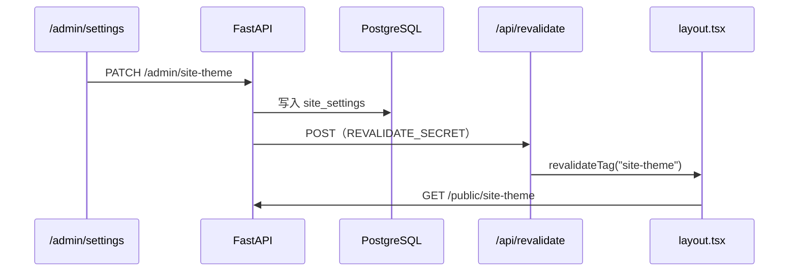

<p align="center">
  <a href="https://github.com/xiongxianzhu/xblog"></a>
  <a href="docs/prd-xblog.md"></a>
  <a href="https://github.com/xiongxianzhu/xblog/blob/main/LICENSE"></a>
</p>

<h1 align="center">AGENT.md</h1>

<p align="center">
  <strong>面向 AI 编码助手与仓库贡献者的协作手册</strong><br/>
  <sub>Cursor Agent · 自动化 PR · 新成员 onboarding</sub>
</p>

<p align="center">
  <a href="https://www.python.org/downloads/"></a>
  <a href="https://nextjs.org/"></a>
  <a href="https://fastapi.tiangolo.com/"></a>
  <a href="https://www.postgresql.org/"></a>
</p>

<p align="center">
  <a href="README.md"><b>根 README</b></a>
  &nbsp;·&nbsp;
  <a href="docs/prd-xblog.md"><b>PRD</b></a>
  &nbsp;·&nbsp;
  <a href="backend/README.md"><b>后端</b></a>
  &nbsp;·&nbsp;
  <a href="frontend/README.md"><b>前端</b></a>
</p>

<p align="center"><sub>— · — · —</sub></p>

---

## 目录

- [项目概览](#-项目概览)
- [开始工作前](#-开始工作前)
- [本地开发](#-本地开发)
- [目录结构](#-目录结构)
- [API 分层](#-api-分层)
- [主题系统（易踩坑）](#-主题系统易踩坑)
- [环境变量](#-环境变量)
- [Git 规范](#-git-规范)
- [编码原则](#-编码原则)
- [常见任务](#-常见任务)
- [部署检查清单](#-部署检查清单)

---

## 📌 项目概览

<p align="center"><strong>xblog</strong> — 自托管个人博客 Monorepo</p>

| | 部分 | 路径 | 职责 |
|:-:|:---|:---|:---|
| 🔧 | 后端 API | `backend/` | FastAPI · PostgreSQL · JWT Cookie · Markdown |
| 🌐 | 前端站点 | `frontend/` | Next.js 公开页（RSC + ISR）+ `/admin` |
| 🚀 | 部署 | `deploy/` | nginx · systemd 示例 |
| 📋 | 需求文档 | `docs/prd-xblog.md` | 产品与技术决策的**权威来源** |

<p align="center"><sub>生产路由：<code>/</code> → Next.js :3000 · <code>/api/</code> → FastAPI :8000（nginx 同域反代）</sub></p>

---

## ⚠️ 开始工作前

> **动手写代码之前，先确认这三件事。**

1. 阅读 [`docs/prd-xblog.md`](docs/prd-xblog.md) 中与任务相关的章节
2. 明确改动层级：公开页 / 后台 / API / 迁移 / 部署——**不要跨层乱改**
3. 数据库只用 **PostgreSQL**（PRD 禁止 SQLite 作为目标环境）

| 🚫 禁止提交 | 说明 |
|------------|------|
| `.env`、`.env.local` | 含密钥与连接串 |
| `uploads/` 用户文件 | 仅保留 `.gitkeep` |
| 真实用户数据 | 隐私与合规 |

---

## 🛠 本地开发

### 前置

| Python + uv | Node.js + pnpm | PostgreSQL |
|:-----------:|:--------------:|:----------:|
| 3.14+ | 20+ / 9+ | 运行中 |

### 后端

```bash
cd backend
make install
make setup          # .env.example → .env
# 编辑 .env：SECRET_KEY、DATABASE_URL
make migrate
make dev            # → http://127.0.0.1:8000
```

<p align="center"><sub>端点 · <code>GET /api/v1/public/health</code> 健康检查 · <code>/docs</code> OpenAPI</sub></p>

### 前端

```bash
cd frontend
pnpm install
pnpm dev            # → http://localhost:3000
```

<p align="center"><sub><code>/api/*</code> 由 <a href="frontend/next.config.ts">next.config.ts</a> 代理到 <code>BACKEND_URL</code>（默认 localhost:8000）</sub></p>

### 质量门禁

```bash
cd backend  && make check              # ruff + mypy + pytest
cd frontend && pnpm lint && pnpm build
```

---

## 📁 目录结构

```text
xblog/
├── AGENT.md                 ← 本文件
├── backend/
│   ├── app/
│   │   ├── api/v1/          # public · admin · auth
│   │   ├── core/            # config · security
│   │   ├── db/              # session
│   │   ├── models/          # SQLModel
│   │   ├── schemas/         # Pydantic
│   │   └── services/        # 业务逻辑
│   ├── alembic/
│   └── tests/
├── frontend/
│   ├── app/                 # App Router
│   ├── components/          # site/ · admin/ · ui/
│   └── lib/                 # api · themes · site-theme
└── deploy/
```

---

## 🔌 API 分层

<p align="center"><sub>注册入口 → <a href="backend/app/api/v1/router.py"><code>backend/app/api/v1/router.py</code></a></sub></p>

| 前缀 | 认证 | 用途 |
|------|:----:|------|
| `/api/v1/public/*` | 无 | 文章、搜索、友链、公开站主题 |
| `/api/v1/auth/*` | 登录流 | Cookie + JWT 签发/刷新 |
| `/api/v1/admin/*` | 管理员 Cookie | CRUD、用户、站点设置 |

> ⚠️ **写操作只放 admin**。不要在 public 路由暴露 POST/PATCH/DELETE。

---

## 🎨 主题系统（易踩坑）

公开页与后台主题 **完全独立**：

| 范围 | 存储 | DOM 作用域 |
|------|------|-----------|
| 公开站 | DB `site_settings` + API | `[data-site-shell]` · `data-site-palette` |
| 管理后台 | `localStorage` `xblog-admin-theme-v2` | `[data-admin-shell]` |

### 刷新链路



| 环境 | 行为 |
|------|------|
| **开发** | `getPublicSiteTheme()` 用 `cache: "no-store"`，保存后刷新即可 |
| **生产** | 必须配置 `REVALIDATE_SECRET` + `REVALIDATE_URL`，否则页面长时间 stale |

> Next.js 16：`revalidateTag(tag, "max")` 需要**第二个参数**。

**关键文件**

| 文件 | 职责 |
|------|------|
| [`frontend/lib/site-theme.ts`](frontend/lib/site-theme.ts) | 服务端拉取 + 缓存 tag |
| [`frontend/app/api/revalidate/route.ts`](frontend/app/api/revalidate/route.ts) | ISR 回调 |
| [`backend/app/services/revalidate.py`](backend/app/services/revalidate.py) | 触发 revalidate |
| [`backend/app/services/site_settings.py`](backend/app/services/site_settings.py) | 读写主题 |

---

## 🔐 环境变量

<details>
<summary><strong>backend/.env</strong></summary>

| 变量 | 说明 |
|------|------|
| `SECRET_KEY` | JWT 签名（生产必须随机强密钥） |
| `DATABASE_URL` | `postgresql+asyncpg://...` |
| `CORS_ORIGINS` | 开发默认 `http://localhost:3000` |
| `REVALIDATE_SECRET` | 与 frontend 一致 |
| `REVALIDATE_URL` | 如 `http://localhost:3000/api/revalidate` |

模板 → [`backend/.env.example`](backend/.env.example)

</details>

<details>
<summary><strong>frontend/.env.local</strong>（可选）</summary>

| 变量 | 说明 |
|------|------|
| `BACKEND_URL` | 服务端 fetch 与 rewrite 目标 |
| `REVALIDATE_SECRET` | 与 backend 一致 |
| `NEXT_PUBLIC_SITE_URL` | sitemap、RSS 绝对 URL |
| `NEXT_PUBLIC_GISCUS_*` | Giscus 评论（可选） |

</details>

---

## 🌿 Git 规范

| 类型 | 分支示例 |
|------|----------|
| 新功能 | `feat/<功能名>` |
| 修复 | `fix/<问题描述>` |
| 文档 | `docs/<主题>` |

**Commit**：Conventional Commits，**描述用简体中文**。

```text
feat: 支持公开站主题预设
fix: 修复保存主题后 ISR 未刷新
docs: 完善 AGENT.md 与 README
```

### Agent 行为准则

- 未经用户明确要求 → **不要** `git commit` / `git push`
- 改动保持 **最小范围**，不顺手重构无关代码
- 新增 DB 字段 → **必须** Alembic 迁移（`make revision MSG="..."` → `make migrate`）

---

## 📐 编码原则

| # | 原则 |
|:-:|------|
| 1 | **先简单** — 只实现任务所需，不加 speculative 抽象 |
| 2 | **跟现有风格** — shadcn/ui + Tailwind，命名与目录一致 |
| 3 | **RSC 优先** — 公开页用 Server Component；后台交互用 Client + SWR |
| 4 | **ISR 联动** — 内容变更后触发 revalidate（文章、主题等已有模式可复用） |
| 5 | **少写文档** — 用户未要求时不主动新建 Markdown |

---

## 🧭 常见任务

<details>
<summary><strong>新增 API 字段</strong></summary>

1. `models/` → `schemas/` → `services/` → `endpoints/`
2. Alembic 迁移
3. 前端 `lib/types.ts` / `lib/api.ts` + 页面
4. `make check` + `pnpm build`

</details>

<details>
<summary><strong>新增公开页路由</strong></summary>

1. `frontend/app/<route>/page.tsx`
2. SEO：metadata + sitemap 联动
3. 样式走 `globals.css` site 变量，避免硬编码颜色

</details>

<details>
<summary><strong>新增后台菜单</strong></summary>

1. `components/admin/admin-shell.tsx` 导航项
2. `app/admin/(shell)/<page>/page.tsx`
3. 对应 admin API + Cookie 权限

</details>

---

## ✅ 部署检查清单

- [ ] `uv sync --frozen --no-dev` + `alembic upgrade head`
- [ ] `pnpm build` + `next start`（systemd）
- [ ] nginx：`/` → 3000，`/api/` → 8000
- [ ] HTTPS · `COOKIE_SECURE=true` · 强 `SECRET_KEY`
- [ ] `REVALIDATE_SECRET` 前后端一致

<p align="center">详细流程 → <a href="deploy/systemd/README.md"><b>deploy/systemd/README.md</b></a></p>

---

<p align="center">
  <sub><a href="LICENSE"><b>MIT License</b></a></sub>
</p>
