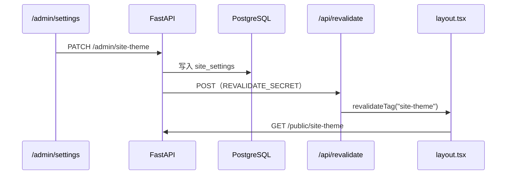

<p align="center">
  <a href="https://github.com/xiongxianzhu/xblog"></a>
  <a href="docs/prd-xblog.md"></a>
  <a href="https://github.com/xiongxianzhu/xblog/blob/main/LICENSE"></a>
</p>

<h1 align="center">AGENT.md</h1>

<p align="center">
  <strong>面向 AI 编码助手与仓库贡献者的协作手册</strong><br/>
  <sub>Cursor Agent · 自动化 PR · 新成员 onboarding</sub>
</p>

<p align="center">
  <a href="https://www.python.org/downloads/"></a>
  <a href="https://nextjs.org/"></a>
  <a href="https://fastapi.tiangolo.com/"></a>
  <a href="https://www.postgresql.org/"></a>
</p>

<p align="center">
  <a href="CONTRIBUTING.md"><b>贡献指南</b></a>
  &nbsp;·&nbsp;
  <a href="docs/git-workflow.md"><b>Git 工作流</b></a>
  &nbsp;·&nbsp;
  <a href="README.md"><b>根 README</b></a>
  &nbsp;·&nbsp;
  <a href="docs/prd-xblog.md"><b>PRD</b></a>
  &nbsp;·&nbsp;
  <a href="backend/README.md"><b>后端</b></a>
  &nbsp;·&nbsp;
  <a href="frontend/README.md"><b>前端</b></a>
</p>

<p align="center"><sub>— · — · —</sub></p>

---

## 目录

- [项目概览](#-项目概览)
- [开始工作前](#-开始工作前)
- [本地开发](#-本地开发)
- [目录结构](#-目录结构)
- [API 分层](#-api-分层)
- [主题系统（易踩坑）](#-主题系统易踩坑)
- [内容与公开页](#-内容与公开页)
- [环境变量](#-环境变量)
- [Git 规范](#-git-规范)
- [编码原则](#-编码原则)
- [常见任务](#-常见任务)
- [部署检查清单](#-部署检查清单)

---

## 📌 项目概览

<p align="center"><strong>xblog</strong> — 自托管个人博客 Monorepo</p>

| | 部分 | 路径 | 职责 |
|:-:|:---|:---|:---|
| 🔧 | 后端 API | `backend/` | FastAPI · PostgreSQL · JWT Cookie · Markdown |
| 🌐 | 前端站点 | `frontend/` | Next.js 公开页（`app/[locale]/` + ISR）+ `/admin`（无 locale） |
| 🚀 | 部署 | `deploy/` | nginx · systemd 示例 |
| 📋 | 需求文档 | `docs/prd-xblog.md` | 产品与技术决策的**权威来源** |

<p align="center"><sub>生产路由：<code>/</code> → Next.js :3000 · <code>/api/</code> → FastAPI :8000（nginx 同域反代）</sub></p>

---

## ⚠️ 开始工作前

> **动手写代码之前，先确认这三件事。**

1. 阅读 [`docs/prd-xblog.md`](docs/prd-xblog.md) 中与任务相关的章节
2. 明确改动层级：公开页 / 后台 / API / 迁移 / 部署——**不要跨层乱改**
3. 数据库只用 **PostgreSQL**（PRD 禁止 SQLite 作为目标环境）

| 🚫 禁止提交 | 说明 |
|------------|------|
| `backend/.env`、`frontend/.env` | 含密钥与连接串 |
| `uploads/` 用户文件 | 仅保留 `.gitkeep` |
| 真实用户数据 | 隐私与合规 |

---

## 🛠 本地开发

### 前置

| Python + uv | Node.js + pnpm | PostgreSQL |
|:-----------:|:--------------:|:----------:|
| 3.14+ | 20+ / 9+ | 运行中 |

### 后端

```bash
cd backend
make install
make setup          # .env.example → .env
# 编辑 .env：SECRET_KEY、DATABASE_URL
make migrate
make dev            # → http://127.0.0.1:8000
```

<p align="center"><sub>端点 · <code>GET /api/v1/public/health</code> 健康检查 · <code>/docs</code> OpenAPI</sub></p>

### 前端

```bash
cd frontend
pnpm install
pnpm dev            # → http://localhost:3000
```

<p align="center"><sub><code>/api/*</code> 由 <a href="frontend/next.config.ts">next.config.ts</a> 代理到 <code>BACKEND_URL</code>（默认 localhost:8000）</sub></p>

### 质量门禁

```bash
cd backend  && make check              # ruff + mypy + pytest
cd frontend && pnpm lint && pnpm build
```

---

## 📁 目录结构

```text
xblog/
├── AGENT.md                 ← 本文件
├── docs/superpowers/        # 功能 design spec · implementation plan
├── backend/
│   ├── app/
│   │   ├── api/v1/          # public · admin · auth · ai
│   │   ├── core/            # config · security
│   │   ├── db/              # session
│   │   ├── models/          # SQLModel
│   │   ├── schemas/         # Pydantic
│   │   └── services/        # 业务逻辑 · ai/ · upload_cleanup · revalidate …
│   ├── alembic/             # 001–013 迁移
│   └── tests/
├── frontend/
│   ├── app/                 # App Router · [locale]/ · admin/
│   ├── components/          # site/ · admin/ · giscus · article-toc · post-card …
│   ├── i18n/                # next-intl 路由与 request
│   ├── messages/            # zh-CN · zh-TW · en 文案
│   ├── proxy.ts             # locale 中间件 · admin 重定向
│   └── lib/                 # api · themes · site-theme · ai-api · pending-upload-cleanup
└── deploy/
```

---

## 🔌 API 分层

<p align="center"><sub>注册入口 → <a href="backend/app/api/v1/router.py"><code>backend/app/api/v1/router.py</code></a></sub></p>

| 前缀 | 认证 | 用途 |
|------|:----:|------|
| `/api/v1/public/*` | 无 | 文章、搜索、友链、公开站主题与品牌 |
| `/api/v1/auth/*` | 登录流 | Cookie + JWT · 短信 · OAuth · 资料 |
| `/api/v1/admin/*` | 管理员 Cookie | CRUD、用户、站点设置、AI 网关 |

> ⚠️ **写操作只放 admin**。不要在 public 路由暴露 POST/PATCH/DELETE。

---

## 🎨 主题系统（易踩坑）

公开页与后台主题 **完全独立**：

| 范围 | 存储 | DOM 作用域 |
|------|------|-----------|
| 公开站 | DB `site_settings` + API | `[data-site-shell]` · `data-site-palette` · 站点名称/副标题/LOGO/**备案号** |
| 管理后台 | `localStorage` `xblog-admin-theme-v2` | `[data-admin-shell]` · **7 款** palette（与公开站 ID 一致） |

### 刷新链路



| 环境 | 行为 |
|------|------|
| **开发** | `getPublicSiteTheme()` 用 `cache: "no-store"`，保存后刷新即可 |
| **生产** | 必须配置 `REVALIDATE_SECRET` + `REVALIDATE_URL`，否则页面长时间 stale |

> Next.js 16：`revalidateTag(tag, "max")` 需要**第二个参数**。

**关键文件**

| 文件 | 职责 |
|------|------|
| [`frontend/lib/site-theme.ts`](frontend/lib/site-theme.ts) | 服务端拉取 + 缓存 tag |
| [`frontend/app/api/revalidate/route.ts`](frontend/app/api/revalidate/route.ts) | ISR 回调 |
| [`backend/app/services/revalidate.py`](backend/app/services/revalidate.py) | 触发 revalidate |
| [`frontend/lib/themes.ts`](frontend/lib/themes.ts) | 7 款 palette 元数据 |
| [`backend/app/services/site_settings.py`](backend/app/services/site_settings.py) | 读写主题与站点品牌 |

---

## 📄 内容与公开页

近期能力速查（改前先读对应文件）：

| 能力 | 后端 | 前端 |
|------|------|------|
| 文章封面 | `POST/DELETE /admin/posts/cover` · `services/uploads.py` · PATCH 时删旧文件 | `post-cover-editor.tsx` · `pending-upload-cleanup.ts` |
| 友链 LOGO | `POST/DELETE /admin/links/logo` · `uploads/link-logos/` | `friend-link-logo-editor.tsx` · 公开页 `links/page.tsx` |
| 上传兜底 | `services/upload_cleanup.py` · `cli cleanup-uploads` | 前端即时 DELETE；cron 扫 `covers/` + `link-logos/` |
| 标签 | `services/posts.py` → `get_or_create_tag` / `sync_tags` | `tags/[slug]/page.tsx` · `decodeRouteParam` |
| 代码块语言 | — | `prose-code-blocks.ts` · 读 `data-code-language` |
| 文章 TOC | `prepareArticleContent` 解析 heading | `article-toc.tsx` · 详情页 `xl:sticky` 侧栏 |
| 备案号页脚 | `site_settings` · `site_icp_number` | `site-footer.tsx` · `public/beian-ghs.png` |
| Giscus | — | `giscus.tsx`（iframe wrapper）· **勿**在父页写 `.gsc-*` 期望生效 |
| 编辑底栏 | — | `post-editor-form.tsx` · `.admin-editor-actions` 固定底部 |
| Turnstile | `login_guard.py` · `GET /auth/login-guard` · `auth_settings` 开关 | `admin-login-screen.tsx` · `admin-turnstile.tsx` |
| 审计日志 | `audit_logs.py` · `GET /admin/logs/login|operations` | `admin-pagination.tsx` · `lib/api.ts` 分页请求 |

**Giscus 注意**：`giscus.app/client.js` 会清空 `.giscus` 子节点再插入 iframe；宽度对齐靠插入后包一层 `div` + `[data-site-shell] .giscus > div`。改 iframe **内部**样式需 custom theme CSS URL。

**封面 / LOGO 删除（三层互补）**：

1. **即时**：取消、关弹窗、离开编辑页 → 前端 `pending-upload-cleanup.ts` 调 `DELETE` API  
2. **保存时**：PATCH 换封面/LOGO 或置空 → 后端删旧 managed 文件（已有）  
3. **兜底**：关浏览器/崩溃 → `uv run python -m app.cli cleanup-uploads`（cron，默认 1h TTL）

编辑页「移除」仅清空表单；未保存的本地上传靠 1 清理，不靠 PATCH。

---

## 🌍 国际化（i18n）

| 区域 | 路由 | 语言解析 |
|------|------|----------|
| 公开站 | `app/[locale]/…` | URL locale + next-intl |
| 管理后台 | `/admin/*`（**无** locale 前缀） | `NEXT_LOCALE` cookie · `i18n/request.ts` |

- `proxy.ts`：将 `/{locale}/admin/*` **重定向**至 `/admin/*`；admin 请求注入 `x-pathname`。
- 文案：`frontend/messages/{zh-CN,zh-TW,en}.json`；切换见 `locale-switcher.tsx` + `locale-actions.ts`。
- **勿**在 admin 路由下加 `[locale]` 段。

---

## 🔐 环境变量

<details>
<summary><strong>backend/.env</strong></summary>

| 变量 | 说明 |
|------|------|
| `SECRET_KEY` | JWT 签名（生产必须随机强密钥） |
| `DATABASE_URL` | `postgresql+asyncpg://...` |
| `CORS_ORIGINS` | 开发默认 `http://localhost:3000` |
| `REVALIDATE_SECRET` | 与 frontend 一致 |
| `REVALIDATE_URL` | 如 `http://localhost:3000/api/revalidate` |
| `AI_KEY_ENCRYPTION_SECRET` | AI Key 加密（可选） |
| `GITHUB_CLIENT_*` / `WECHAT_*` | OAuth（可选） |
| `SMS_PROVIDER` | 短信验证码；开发用 `dev`（验证码打日志） |
| `TURNSTILE_SITE_KEY` / `TURNSTILE_SECRET_KEY` | Cloudflare Turnstile |
| `LOGIN_CAPTCHA_AFTER_FAILURES` 等 | 登录失败触发验证码 · 限流（见 `.env.example`） |

模板 → [`backend/.env.example`](backend/.env.example)

</details>

<details>
<summary><strong>frontend/.env</strong>（复制 <code>.env.example</code>）</summary>

| 变量 | 说明 |
|------|------|
| `BACKEND_URL` | 服务端 fetch 与 rewrite 目标 |
| `REVALIDATE_SECRET` | 与 backend 一致 |
| `NEXT_PUBLIC_SITE_URL` | sitemap、RSS 绝对 URL |
| `NEXT_PUBLIC_TURNSTILE_SITE_KEY` | 与 backend `TURNSTILE_SITE_KEY` 相同 |
| `NEXT_PUBLIC_GISCUS_*` | Giscus 评论（可选，见 `.env.example` 完整字段） |

</details>

---

## 🌿 Git 规范

> 完整流程见 [CONTRIBUTING.md](CONTRIBUTING.md) · [docs/git-workflow.md](docs/git-workflow.md)

| 类型 | 分支示例 |
|------|----------|
| 新功能 | `feat/<功能名>` |
| 修复 | `fix/<问题描述>` |
| 文档 | `docs/<主题>` |
| 重构 | `refactor/<描述>` |
| 其他 | `chore/` · `test/` · `ci/` · `build/` |

**Commit**：Conventional Commits，**描述用简体中文**；可选范围如 `feat(backend):`、`fix(frontend):`。

```text
feat: 支持公开站主题预设
fix(frontend): 修复 Giscus 环境变量未生效
docs: 补充 Git 工作流与贡献指南
```

**PR**：从 `main` 切分支 → 本地检查 → 开 PR → Squash merge。使用 [.github/PULL_REQUEST_TEMPLATE.md](.github/PULL_REQUEST_TEMPLATE.md)。

### Agent 行为准则

- 未经用户明确要求 → **不要** `git commit` / `git push`
- 改动保持 **最小范围**，不顺手重构无关代码
- 新增 DB 字段 → **必须** Alembic 迁移（`make revision MSG="..."` → `make migrate`）

---

## 📐 编码原则

| # | 原则 |
|:-:|------|
| 1 | **先简单** — 只实现任务所需，不加 speculative 抽象 |
| 2 | **跟现有风格** — shadcn/ui + Tailwind，命名与目录一致 |
| 3 | **RSC 优先** — 公开页用 Server Component；后台交互用 Client + SWR |
| 4 | **ISR 联动** — 内容变更后触发 revalidate（文章、主题等已有模式可复用） |
| 5 | **少写文档** — 用户未要求时不主动新建 Markdown |

---

## 🧭 常见任务

<details>
<summary><strong>新增 API 字段</strong></summary>

1. `models/` → `schemas/` → `services/` → `endpoints/`
2. Alembic 迁移
3. 前端 `lib/types.ts` / `lib/api.ts` + 页面
4. `make check` + `pnpm build`

</details>

<details>
<summary><strong>新增公开页路由</strong></summary>

1. `frontend/app/[locale]/<route>/page.tsx`
2. SEO：metadata + sitemap 联动
3. 文案加入 `messages/*.json`
4. 样式走 `globals.css` site 变量，避免硬编码颜色

</details>

<details>
<summary><strong>新增后台菜单</strong></summary>

1. `lib/admin-nav.ts` 导航项
2. `app/admin/(shell)/<page>/page.tsx`
3. 对应 admin API + Cookie 权限

</details>

<details>
<summary><strong>文章封面 / 标签 / 友链 LOGO</strong></summary>

1. 封面：`models/post.cover_url` · `admin/posts.py` upload/PATCH · `uploads/covers/`
2. 友链 LOGO：`admin/links/logo` · `uploads/link-logos/` · `friend_link.description`（迁移 013）
3. 未保存清理：前端 `pending-upload-cleanup.ts` · 后端 `upload_cleanup.py` + CLI
4. 标签：`sync_tags` 自动创建 · 中文 slug 走 URL 编码 · 标签页解码 `decodeRouteParam`
5. 公开页：`resolvePublicAssetUrl` · ISR 与 revalidate 同文章发布链路
6. 测试：`test_post_cover.py` · `test_post_tags.py` · `test_upload_cleanup.py`

</details>

<details>
<summary><strong>Turnstile 登录防护</strong></summary>

- 配置：`TURNSTILE_*` + `NEXT_PUBLIC_TURNSTILE_SITE_KEY` · 后台 **设置 → 登录方式** 启用
- 逻辑：`login_guard.py` · 密码失败 N 次后必填 · 找回密码始终验证
- 前端：`GET /auth/login-guard?username=` 决定登录页是否渲染 Turnstile

</details>

<details>
<summary><strong>AI 助手相关</strong></summary>

- 后端：`services/ai/gateway.py` · `POST /admin/ai/complete`（SSE：`delta` / `thinking` / `done` · 支持 `skill_ids` 多 Skill）
- 前端 BFF：`app/api/v1/admin/ai/complete/route.ts`
- UI：`ai-composer.tsx`（Skill Chip、`/` 列表、快捷按钮、模型选择）· `editor-ai-assistant-layout.tsx` · `ai-assistant-panel.tsx`
- 内置 Skill：`blog-chat-zh` · `blog-polish-zh` · `blog-generate-zh` · `blog-format-zh` · `blog-excerpt-zh`
- 设计 spec：[`docs/superpowers/specs/2026-07-05-ai-editor-composer-design.md`](docs/superpowers/specs/2026-07-05-ai-editor-composer-design.md)
- 改 Skill 默认：`ai_skill_default` 表 + 设置页

</details>

<details>
<summary><strong>上传孤儿清理</strong></summary>

- 范围：仅 `uploads/covers/`、`uploads/link-logos/`（非全盘扫描）
- 服务：`services/upload_cleanup.py` · 对比 `posts.cover_url` / `friend_links.logo_url`
- CLI：`uv run python -m app.cli cleanup-uploads [--max-age 3600] [--dry-run]`
- 测试：`tests/test_upload_cleanup.py`
- 设计：[`docs/superpowers/specs/2026-07-05-upload-orphan-cleanup-design.md`](docs/superpowers/specs/2026-07-05-upload-orphan-cleanup-design.md)

</details>

---

## ✅ 部署检查清单

- [ ] `uv sync --frozen --no-dev` + `alembic upgrade head`
- [ ] `pnpm build` + `next start`（systemd）
- [ ] nginx：`/` → 3000，`/api/` → 8000
- [ ] HTTPS · `COOKIE_SECURE=true` · 强 `SECRET_KEY`
- [ ] `REVALIDATE_SECRET` 前后端一致
- [ ] Turnstile 生产 Key 与后台开关按需配置
- [ ] 生产 cron：`cleanup-uploads`（见 [backend/README.md](backend/README.md)）

<p align="center">详细流程 → <a href="deploy/systemd/README.md"><b>deploy/systemd/README.md</b></a></p>

---

<p align="center">
  <sub><a href="LICENSE"><b>MIT License</b></a></sub>
</p>
