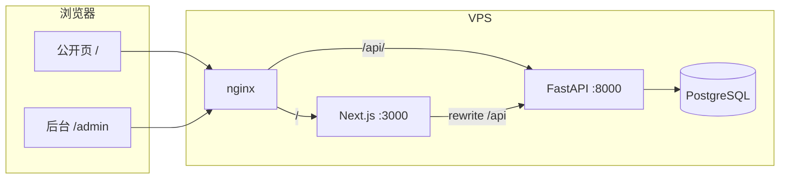

<p align="center">
  <a href="https://github.com/xiongxianzhu/xblog"></a>
  <a href="https://github.com/xiongxianzhu/xblog/blob/main/LICENSE"></a>
</p>

<h1 align="center">xblog</h1>

<p align="center">
  <strong>可自托管的个人博客 Monorepo</strong><br/>
  <sub>FastAPI 后端 · Next.js 前端 · Markdown 写作 · Giscus 评论 · MIT 开源</sub>
</p>

<p align="center">
  <a href="https://www.python.org/downloads/"></a>
  <a href="https://fastapi.tiangolo.com/"></a>
  <a href="https://nextjs.org/"></a>
  <a href="https://react.dev/"></a>
</p>

<p align="center">
  <a href="https://www.typescriptlang.org/"></a>
  <a href="https://www.postgresql.org/"></a>
  <a href="https://pnpm.io/"></a>
  <a href="https://github.com/astral-sh/uv"></a>
</p>

<p align="center">
  <a href="docs/prd-xblog.md"><b>产品需求</b></a>
  &nbsp;·&nbsp;
  <a href="CONTRIBUTING.md"><b>参与贡献</b></a>
  &nbsp;·&nbsp;
  <a href="AGENT.md"><b>AI 协作说明</b></a>
  &nbsp;·&nbsp;
  <a href="backend/README.md"><b>后端文档</b></a>
  &nbsp;·&nbsp;
  <a href="frontend/README.md"><b>前端文档</b></a>
</p>

<p align="center"><sub>— · — · —</sub></p>

---

## 目录

- [特性](#特性)
- [架构一览](#架构一览)
- [快速开始](#快速开始)
- [技术栈](#技术栈)
- [仓库结构](#仓库结构)
- [文档索引](#文档索引)
- [参与贡献](#参与贡献)
- [生产部署](#生产部署)
- [故障排查](#故障排查)

---

## 特性

| | 能力 | 说明 |
|:---:|:---|:---|
| ✍️ | **在线写作** | 浏览器 Markdown 编辑，发布即前台可见 |
| 🔍 | **SEO 友好** | SSR/ISR、sitemap、RSS、结构化 metadata |
| 🎨 | **双主题体系** | 公开站主题（后台统一配置）与后台主题（本地偏好）分离 |
| 🖥 | **管理后台** | 可折叠侧栏、毛玻璃顶栏、2px 扁平风、全宽主内容、头像与设置 |
| 💬 | **Giscus 评论** | 文章详情页 GitHub Discussions 评论（env 配置，可选） |
| 🏠 | **自托管** | nginx + systemd + PostgreSQL，数据在自己手里 |
| 🤝 | **开源协作** | CONTRIBUTING、Git 工作流、Issue/PR 模板、`llms.txt` |
| 📜 | **MIT 开源** | 可 fork、可改、可部署 |

---

## 架构一览



<p align="center"><sub><b>同域路由</b>：/ → Next.js · /api/ → FastAPI · 开发时 Next 代理 /api/* 到 localhost:8000</sub></p>

---

## 快速开始

### 前置

| Python | uv | Node.js | pnpm | PostgreSQL |
|:------:|:--:|:-------:|:----:|:----------:|
| 3.14+ | 最新 | 20+ | 9+ | 16+ |

### 1 · 克隆

```bash
git clone git@github.com:xiongxianzhu/xblog.git
cd xblog
```

### 2 · 后端

```bash
cd backend
make install && make setup
# 编辑 .env：SECRET_KEY、DATABASE_URL
make migrate && make dev
```

<p align="center">→ API 文档：<a href="http://127.0.0.1:8000/docs"><code>http://127.0.0.1:8000/docs</code></a></p>

### 3 · 前端

```bash
cd frontend
pnpm install && pnpm dev
```

| 地址 | 用途 |
|------|------|
| <http://localhost:3000> | 公开站 |
| <http://localhost:3000/admin> | 管理后台 |

> 💡 后端端口非 `8000` 时，在 `frontend/.env` 设置 `BACKEND_URL`。

### 4 · 可选：Giscus 评论

```bash
cd frontend
cp .env.example .env
# 填写 NEXT_PUBLIC_GISCUS_*（见 https://giscus.app/zh-CN）
pnpm dev
```

仓库需启用 GitHub **Discussions**。未配置时文章页会显示引导文案。

---

## 技术栈

### 后端 `backend/`

| 类别 | 技术 |
|------|------|
| 语言 | Python 3.14 |
| 框架 | FastAPI |
| ORM | SQLModel · Alembic |
| 认证 | Cookie + JWT · bcrypt |
| 数据库 | PostgreSQL |
| 工具链 | uv · ruff · mypy · pytest |

脚手架：[create-fastapi](https://github.com/xiongxianzhu/create-fastapi)

### 前端 `frontend/`

| 类别 | 技术 |
|------|------|
| 框架 | Next.js 16 · React 19 · TS |
| 样式 | Tailwind CSS 4 · shadcn/ui |
| 公开页 | RSC + ISR |
| 后台 | Client Components · SWR |
| 评论 | Giscus（GitHub Discussions） |

<p align="center"><sub><b>部署</b>：nginx · uvicorn · next start · systemd</sub></p>

---

## 仓库结构

```text
xblog/
├── AGENT.md              ← AI 助手与贡献者速查
├── llms.txt              ← LLM 仓库导航（llms.txt 规范）
├── CONTRIBUTING.md       ← 参与贡献入口
├── README.md             ← 你在这里
├── backend/              ← FastAPI API
├── frontend/             ← Next.js 站点 + /admin
├── deploy/               ← nginx · systemd 示例
├── docs/                 ← PRD · Git 工作流
└── .github/              ← Issue / PR 模板
```

---

## 文档索引

| 文档 | 适合谁 | 内容 |
|------|--------|------|
| [AGENT.md](AGENT.md) | AI / 新贡献者 | 目录约定、环境变量、主题 ISR、Git 规范 |
| [llms.txt](llms.txt) | LLM / AI 工具 | 仓库导航索引（llms.txt 规范，链到核心文档与入口代码） |
| [docs/prd-xblog.md](docs/prd-xblog.md) | 产品 / 架构 | 需求、验收标准、技术决策 |
| [backend/README.md](backend/README.md) | 后端开发 | API、迁移、部署、排错 |
| [frontend/README.md](frontend/README.md) | 前端开发 | 路由、主题、构建、排错 |
| [deploy/systemd/README.md](deploy/systemd/README.md) | 运维 | 生产进程守护 |
| [CONTRIBUTING.md](CONTRIBUTING.md) | 贡献者 | 分支、Commit、PR 流程 |
| [docs/git-workflow.md](docs/git-workflow.md) | 维护者 / 贡献者 | Git 协作规范详解 |

---

## 参与贡献

欢迎 Issue、文档改进与 Pull Request。

1. 阅读 [CONTRIBUTING.md](CONTRIBUTING.md) 了解分支与 Commit 规范  
2. 详细流程见 [docs/git-workflow.md](docs/git-workflow.md)  
3. 提 PR 前请运行 `make check`（backend）与 `pnpm lint && pnpm build`（frontend）

```bash
git checkout -b feat/your-feature main
# 开发…
git commit -m "feat: 你的改动说明"
git push -u origin feat/your-feature
```

然后在 GitHub 发起 Pull Request。

---

## 生产部署

```text
① 配置 backend/.env + frontend/.env（含 REVALIDATE_SECRET）
② uv sync --frozen --no-dev && alembic upgrade head
③ pnpm build && next start（systemd）
④ nginx：/ → :3000，/api/ → :8000
```

<p align="center">详细步骤 → <a href="deploy/systemd/README.md"><b>deploy/systemd/README.md</b></a></p>

---

## 故障排查

| 现象 | 可能原因 | 处理 |
|------|----------|------|
| 公开页主题不生效 | `REVALIDATE_SECRET` 未配或缓存 | 对齐前后端密钥；开发环境硬刷新 |
| 评论不显示 | 未配置 `NEXT_PUBLIC_GISCUS_*` | 复制 `frontend/.env.example` → `.env` 并重启 |
| 前端 API 404 | 后端未启动 / `BACKEND_URL` 错误 | `make dev` + 检查 `frontend/.env` |
| 迁移失败 | PostgreSQL 未就绪 | 检查 `DATABASE_URL` |

<p align="center">主题相关 → <a href="AGENT.md#-主题系统易踩坑"><b>AGENT.md · 主题系统</b></a></p>

---

<p align="center">
  <sub><b>License</b> · <a href="LICENSE">MIT</a></sub>
</p>
