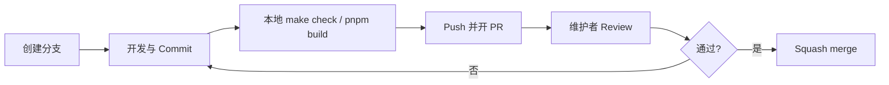

# Git 工作流规范

<p align="center">
  <sub>xblog 开源协作 · 分支 · Commit · PR · Review</sub>
</p>

<p align="center">
  <a href="../CONTRIBUTING.md"><b>CONTRIBUTING.md</b></a>
  &nbsp;·&nbsp;
  <a href="../AGENTS.md"><b>AGENTS.md</b></a>
  &nbsp;·&nbsp;
  <a href="prd-xblog.md"><b>PRD</b></a>
</p>

---

## 1. 我们的原则

| 原则 | 说明 |
|------|------|
| **main 可部署** | `main` 分支应随时可构建、可部署 |
| **小步合并** | 偏好小 PR，便于 Review 与回滚 |
| **语义清晰** | 分支名、Commit、PR 标题让人一眼看懂改了什么 |
| **中文优先** | Commit / PR 描述默认使用简体中文 |
| **秘密不进库** | 密钥、`.env`、私人数据绝不提交 |

---

## 2. 仓库模型

```text
origin/main          ← 稳定分支，受保护（逻辑上）
    ↑
    └── feat/xxx     ← 功能分支
    └── fix/xxx      ← 修复分支
    └── docs/xxx     ← 文档分支
```

### 外部贡献者

1. Fork `xiongxianzhu/xblog`
2. 在 Fork 上创建分支并推送
3. 向 upstream `main` 发起 Pull Request

### 维护者 / 本地开发

```bash
git clone git@github.com:xiongxianzhu/xblog.git
cd xblog
git checkout -b feat/your-feature main
```

---

## 3. 分支规范

### 命名格式

```text
<prefix>/<简短描述>
```

- 使用 **英文小写** 与 **连字符** `-`
- 描述简短（2～4 个词），避免 `feat/update` 这类无信息命名

### 前缀对照

| prefix | 何时使用 |
|--------|----------|
| `feat/` | 用户可见的新能力 |
| `fix/` | 修复 Bug |
| `docs/` | README、PRD、CONTRIBUTING 等 |
| `refactor/` | 结构调整，不改变对外行为 |
| `test/` | 补测试 |
| `chore/` | 工具链、忽略规则等 |
| `ci/` | GitHub Actions 等 |
| `build/` | 依赖、锁文件、构建配置 |

### 示例

```text
feat/admin-theme-settings
fix/revalidate-tag-next16
docs/git-workflow
chore/root-gitignore
```

---

## 4. Commit 规范

### 格式

```text
<type>[可选范围]: <描述>

[正文：说明为什么改，而非重复 diff]

[页脚：BREAKING CHANGE: ... / Closes #123]
```

### 范围（可选）

Monorepo 建议用范围标明影响面：

```text
feat(backend): 新增公开站主题 API
fix(frontend): 修复 Giscus 未读取 env
docs: 补充 Git 工作流文档
```

### 良好 vs 不佳

| ✅ 良好 | ❌ 不佳 |
|---------|---------|
| `fix: 修复保存主题后 ISR 未刷新` | `fix bug` |
| `feat: 文章详情页集成 Giscus 评论` | `update` |
| `docs: 添加 CONTRIBUTING 与 PR 模板` | `misc` |

### 原子提交

- 一个 Commit 解决 **一个逻辑点**
- 不要混进无关格式化、无关重命名
- WIP 勿 push 到共享分支；本地 `git rebase -i` 整理后再提 PR

---

## 5. Pull Request 流程



### PR 标题

与首条 Commit 或整体意图一致，例如：

```text
feat: 集成 Giscus 评论并支持环境变量配置
docs: 建立 Git 工作流与贡献指南
```

### PR 描述应包含

1. **做了什么**（1～3 句）
2. **为什么**（动机 / 关联 Issue）
3. **如何验证**（命令、页面、截图）
4. **影响范围**（backend / frontend / deploy）

### Review 文化

| 角色 | 期望 |
|------|------|
| 作者 | 及时回复评论；小改自己 push；大改说明方案 |
| Reviewer | 明确 approve / request changes；建议具体可执行 |
| 维护者 | 冲突时以 PRD 与 `main` 稳定性为准 |

---

## 6. 合并策略

| 策略 | xblog 约定 |
|------|------------|
| **Squash merge** | ✅ 默认：多条 Commit  squash 为一条进入 `main` |
| Merge commit | 仅特殊情况下使用 |
| Rebase merge | 维护者可选，需与作者沟通 |

合并后删除远程功能分支（GitHub 勾选 *Delete branch*）。

---

## 7. 版本与发布（维护者）

当前为早期项目，版本号见各子包 `pyproject.toml` / `package.json`。

建议节奏：

1. 累积若干 `feat` / `fix` 后打 tag，如 `v0.2.0`
2. Tag 消息简要列出变更
3. Release Notes 可引用 PR 列表

```bash
git tag -a v0.2.0 -m "v0.2.0: Giscus 评论与 Git 工作流文档"
git push origin v0.2.0
```

---

## 8. 禁止事项

| 🚫 | 原因 |
|----|------|
| 提交 `backend/.env` / `frontend/.env` | 含密钥 |
| Force push 到 `main` | 破坏协作历史 |
| 巨型 PR（>500 行无说明） | 难以 Review |
| 未跑检查就提 PR | 浪费 Review 轮次 |
| 在 PR 中夹带无关「顺手优化」 | 违背小步原则 |

---

## 9. 快速命令参考

```bash
# 同步 main
git checkout main && git pull origin main

# 新建功能分支
git checkout -b feat/my-feature

# 查看状态
git status
git log --oneline -10

# 推送并关联远程
git push -u origin feat/my-feature

# 后端质量
cd backend && make check

# 前端质量
cd frontend && pnpm lint && pnpm build
```

---

## 10. 相关文档

| 文档 | 内容 |
|------|------|
| [CONTRIBUTING.md](../CONTRIBUTING.md) | 贡献入口 |
| [AGENTS.md](../AGENTS.md) | AI 助手与开发者速查 |
| [prd-xblog.md](prd-xblog.md) | 产品需求与验收 |

---

<p align="center"><sub>文档版本 · 2026-07-05</sub></p>
