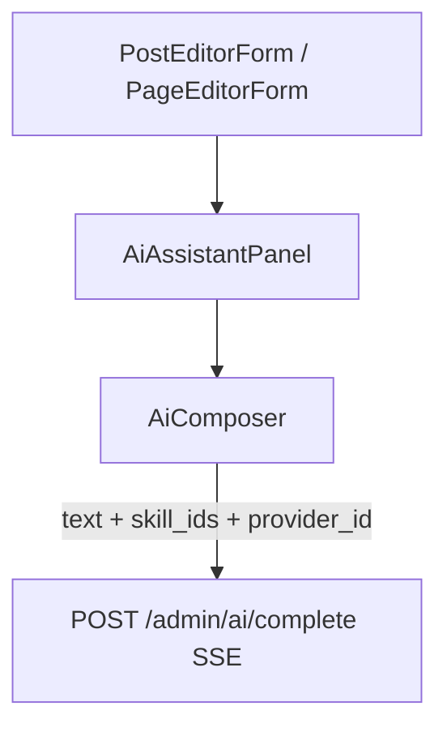

# xblog AI 编辑器 Composer 设计说明

| 字段 | 值 |
|------|-----|
| 状态 | 已实现（2026-07-05） |
| 前置文档 | [2026-07-05-ai-writing-skills-design.md](./2026-07-05-ai-writing-skills-design.md) |
| 参考 UI | CSDN Markdown 编辑器 AI 助手 |

---

## 1. 问题与目标

### 1.1 问题

现有 `AiAssistantPanel` 仅提供单一 Skill 下拉与简单文本输入，与 CSDN 等主流编辑器 AI 助手体验差距较大：

- 无法通过 `/` 快速组合多个 Skill
- 缺少「智能排版 / 优化全文 / 提取摘要」等一键操作
- 无法在对话输入区选择模型
- Skill 选中态与输入区分离，不够直观

### 1.2 目标

在 **不改变 Markdown 编辑器三栏布局** 的前提下，升级右侧 AI 助手 **Agent 对话 Tab**：

1. 输入框内展示已选 Skill（Chip），输入 `/` 唤起 Skill 列表
2. 同一条消息内可多次 `/` 选择 Skill，**每个 Skill 只能选一次**
3. 快捷按钮紧贴输入框上方，点击后 **预填 Skill + 默认指令**，由用户 **手动点发送** 才发起请求
4. 输入框底部提供 **模型（提供商）选择**
5. 后端支持 **`skill_ids` 多 Skill 合并**（单次请求，合并 system prompt）

### 1.3 成功标准

| # | 标准 | 验收 |
|---|------|------|
| SC-CMP-1 | 输入 `/` 可选 Skill，已选 Skill 不再出现在列表 | 选 A 后列表无 A；移除 Chip 后可再选 |
| SC-CMP-2 | 同一条消息可选多个 Skill（≤5） | 选 2+ Skill 发送 → 后端 system 含全部 Skill body |
| SC-CMP-3 | 快捷按钮预填可编辑 | 点击智能排版 / 优化全文 / 提取摘要 → 输入框与 Chip 已填好 → 用户点发送才请求 |
| SC-CMP-4 | 模型可选 | 下拉切换提供商 → 请求带对应 `provider_id` |
| SC-CMP-5 | 未手动选 Skill 时行为与旧版一致 | 无 Chip 时走场景默认 + 关键词推荐 |
| SC-CMP-6 | 提取摘要写入文章 excerpt | 文章编辑页「摘要」字段更新；页面编辑无该按钮 |

### 1.4 Non-Goals

- 不把 AI 助手嵌入 `MarkdownEditor` 第三栏（保持侧栏 `AiAssistantPanel`）
- 不做 Skill **流水线**（多 Skill 为一次请求合并 prompt，非串行多次调用）
- 快捷按钮点击后 **替换** 当前输入与已选 Skill（预填态），发送前用户可编辑文案或再 `/` 追加 Skill
- 「全文生成」Tab 暂保留原有单 Skill 下拉，不在本阶段改造

---

## 2. 交互设计

### 2.1 布局（参考 CSDN）

```text
┌─ AI 助手 · Agent ──────────────────┐
│ [消息历史 · 滚动]                   │
├────────────────────────────────────┤
│ [智能排版] [优化全文] [提取摘要]     │  ← 紧贴输入框上方（gap 小）
├────────────────────────────────────┤
│ ┌─ 输入框容器（圆角 border）──────┐ │
│ │ blog-format-zh ×  blog-polish × │ │  ← 已选 Skill 在框**内**顶部
│ │ 输入创作需求，/ 选择 Skill…      │ │
│ │ ─────────────────────────────── │ │
│ │ DeepSeek · model ▼      [发送]  │ │  ← 底部工具栏
│ └─────────────────────────────────┘ │
└────────────────────────────────────┘
```

### 2.2 `/` Skill 选择

| 规则 | 说明 |
|------|------|
| 触发 | 输入 `/` 或 `/query`（行内 token） |
| 列表 | 仅展示 `enabled` 且 **未选中** 的 Skill |
| 过滤 | `/query` 按 Skill `name` 子串匹配 |
| 选中 | 插入 Chip，删除输入中的 `/query` 片段 |
| 移除 | Chip 上 × 移除，该 Skill 重新回到列表 |
| 去重 | 同一输入框内每个 Skill 只能存在一次 |
| 键盘 | `↑↓` 移动、`Enter` 确认、`Esc` 关闭 |
| 发送后 | 清空输入与全部 Chip |

### 2.3 快捷按钮（预填 + 手动发送）

| 按钮 | 挂载 Skill | 默认用户消息 | 结果处理 |
|------|------------|--------------|----------|
| 智能排版 | `blog-format-zh` | 请对当前正文进行智能排版… | `replace-content`：覆盖正文 |
| 优化全文 | `blog-polish-zh` | 请优化当前正文… | 同上 |
| 提取摘要 | `blog-excerpt-zh` | 请提取一段 excerpt 摘要 | `excerpt`：写入摘要字段 |

点击快捷按钮时：

1. 将默认指令 **写入输入框**（可编辑）
2. 输入框内 **仅挂载对应单个 Skill** Chip
3. 设置 `pendingApplyMode`（排版/润色 → `replace-content`，摘要 → `excerpt`）
4. **不自动发送**；用户确认后点「发送」或 `Ctrl+Enter`

发送时携带 `applyMode`；发送成功后清空输入、Chip 与 `pendingApplyMode`。

### 2.4 模型选择

- 数据源：`GET /admin/ai/providers`，过滤 `enabled && has_api_key`
- 展示：`{name} · {model}`；当 `name` 与 `model` 相同（忽略大小写）时 **只显示一项**，避免 `glm-5.2 · glm-5.2` 重复
- 默认：当前 `is_default` 提供商
- 持久化：`sessionStorage` 键 `xblog-admin-ai-provider-id`
- 请求：SSE `POST /admin/ai/complete` 携带 `provider_id`

---

## 3. 架构与模块

### 3.1 组件拆分



| 模块 | 路径 | 职责 |
|------|------|------|
| `AiComposer` | `frontend/components/admin/ai-composer.tsx` | 快捷按钮、框内 Skill Chip、`/` 菜单、模型选择、发送 |
| `AiAssistantPanel` | `frontend/components/admin/ai-assistant-panel.tsx` | Tab、消息区、组合 Composer、应用结果到正文/摘要 |
| `ai-api` | `frontend/lib/ai-api.ts` | `skill_ids`、流式请求 |
| `resolve_skills` | `backend/app/services/ai/recommend.py` | 多 Skill 解析与 body 合并 |
| `stream_complete` | `backend/app/services/ai/gateway.py` | 组装 messages、SSE 输出 |

### 3.2 数据流

```text
用户输入 + Chip Skill IDs + provider_id
        ↓
AiAssistantPanel.runChat()
        ↓
streamAiComplete({ action: "chat", skill_ids, provider_id, messages, document })
        ↓
resolve_skills() → 合并 Skill body → _build_messages()
        ↓
stream_llm() → SSE delta/thinking/done
        ↓
applyChatResult(applyMode) → 插入对话 / 覆盖正文 / 写 excerpt
```

---

## 4. API 变更

### 4.1 请求体扩展

`AiCompleteRequest` 新增字段（向后兼容）：

```python
skill_id: UUID | None = None      # 保留：单 Skill 旧客户端
skill_ids: list[UUID] = []        # 新增：优先于 skill_id
```

约束：

- `skill_ids` 最多 **5** 个，重复 ID 去重保留顺序
- 当 `skill_ids` 非空时 **跳过** 自动推荐，按 ID 加载 Skill
- 当 `skill_ids` 为空且 `skill_id` 为空时，沿用 `resolve_skill()` 推荐逻辑

### 4.2 Skill body 合并格式

```markdown
### Skill: blog-format-zh

{skill body}

### Skill: blog-polish-zh

{skill body}
```

写入 system prompt 的 `## 写作 Skill` 段落。

### 4.3 响应 `done` 事件

- `skill_id`：首个 Skill ID（兼容 usage 日志）
- `skill_name`：逗号连接的 Skill 名称列表

---

## 5. 内置 Skill 增补

| name | 用途 | 目录 |
|------|------|------|
| `blog-format-zh` | 智能排版 | `backend/app/data/builtin_skills/blog-format-zh/` |
| `blog-excerpt-zh` | 提取摘要 | `backend/app/data/builtin_skills/blog-excerpt-zh/` |

已有 `blog-polish-zh` 用于「优化全文」。

---

## 6. 前端类型

```typescript
type AiComposerApplyMode = "none" | "replace-content" | "excerpt";

type AiComposerSendPayload = {
  text: string;
  skillIds: string[];
  providerId: string | null;
  applyMode?: AiComposerApplyMode;
};
```

`AiAssistantPanel` 可选 prop：

```typescript
onUpdateExcerpt?: (text: string) => void;
```

- 文章编辑页传入 → 显示「提取摘要」按钮
- 页面编辑页不传 → 隐藏该按钮

---

## 7. 错误处理

| 场景 | 行为 |
|------|------|
| 无可用提供商 | Composer 禁用，面板顶部引导至 AI 模型设置 |
| Skill 被禁用 | 不出现在 `/` 列表；快捷按钮 disabled |
| 覆盖正文 | Agent 对话结束后 **直接** `onReplaceContent`，无 `window.confirm` |
| SSE 错误 | 面板底部 `error` 文案，不清空消息历史 |
| 单条 Skill 加载失败 | 跳过该 ID，其余 Skill 仍合并 |

---

## 8. 测试

| 范围 | 用例 |
|------|------|
| 后端 | `test_ai_skills_include_builtin` 含 `blog-format-zh`、`blog-excerpt-zh` |
| 后端 | `skill_ids` 校验（>5 拒绝）— 可按需补充 |
| 前端 | 手动：/` 多选、Chip 去重、快捷按钮、模型切换、摘要写入 |

---

## 9. 实现清单

- [x] `AiComposer` 组件
- [x] `AiAssistantPanel` Agent Tab 接入
- [x] `skill_ids` 后端 + gateway 合并
- [x] 内置 Skill `blog-format-zh`、`blog-excerpt-zh`
- [x] `post-editor-form` 传入 `onUpdateExcerpt`
- [ ] 可选：为 `skill_ids` 增加集成测试（mock LLM）

---

## 10. 后续可选增强

- 「全文生成」Tab 复用 `AiComposer` 模型选择
- 快捷按钮执行进度在消息区展示专用卡片
- 记住上次使用的 Skill 组合（localStorage）
- Skill Chip 展示 description -tooltip
