# xblog AI 写作与 Agent Skills 设计说明

| 字段 | 值 |
|------|-----|
| 状态 | 已批准（2026-07-05） |
| 关联 PRD | Phase 2 · 待增补 §3 AI System Requirements |
| 规范 | [Agent Skills Specification](https://agentskills.io/specification) |

---

## 1. 问题与目标

### 1.1 问题

管理员在 xblog 后台用 Markdown 写作时，缺少 AI 辅助：无法润色选段、对话改稿，也无法从主题/大纲快速生成草稿。同时希望复用符合 [agentskills.io](https://agentskills.io/home) 的 Skill 包，在后台管理写作风格与流程。

### 1.2 目标

- 管理后台可 **配置多个模型提供商**（OpenAI、GLM、MiniMax、DeepSeek 等），由用户 **激活** 后使用；API Key **仅存服务端**。
- 支持三种写作方式：**选区操作**、**侧边栏对话**、**全文生成**（主题/大纲 → 草稿）。
- Skill 完全符合 Agent Skills 目录规范；支持 **上传 / 创建 / 编辑 / 删除**。
- Skill 使用策略：**场景默认** + **description 自动推荐** + **用户可改选**。

### 1.3 成功标准

| # | 标准 | 验收 |
|---|------|------|
| SC-AI-1 | 管理员在后台添加并激活至少 1 个提供商后，可在文章编辑页完成选区润色 | 选中文本 → 润色 → 流式结果 → 替换选区 |
| SC-AI-2 | Skill 上传不符合 agentskills.io 规范时被拒绝并给出明确错误 | 故意错误 frontmatter → 422 + 说明 |
| SC-AI-3 | 对话改稿与全文生成在 P2/P3 交付后可用 | 见 §7 分阶段 |
| SC-AI-4 | 任何 API 响应或日志不泄露 API Key | 抓包 / DB 审计 |
| SC-AI-5 | 未激活任何提供商时，AI 入口不可用并提示去设置页配置 | 空配置 → 引导文案 |

### 1.4 Non-Goals（MVP 不做）

- 访客侧 AI、公开 AI API
- 在服务端 **执行** Skill 内 `scripts/`（仅作说明或 prompt 引用，不跑脚本）
- 多租户 / 多管理员独立 Key（保持单管理员假设）
- 自动发布、批量 SEO 生成
- Embedding 向量路由（MVP 用关键词匹配 + 默认 Skill 兜底）

---

## 2. 用户与场景

### 2.1 角色

| 角色 | 说明 |
|------|------|
| 管理员 | 唯一使用者：配置提供商、管理 Skill、在编辑器中调用 AI |

### 2.2 核心流程

```text
配置提供商（设置 → AI 模型）→ 激活默认提供商
        ↓
管理 Skill（设置 → Skills）→ 上传/编辑/启用
        ↓
设置场景默认 Skill + 可选自动推荐
        ↓
文章编辑页：选区 / 对话 / 全文生成 → 后端 SSE → 应用结果
```

---

## 3. 架构概览

采用 **后端统一 AI 网关**（FastAPI 模块），前端不接触 Key。

```mermaid
flowchart TB
  subgraph AdminUI["管理后台 /admin"]
    Editor["文章编辑器"]
    Settings["AI 设置 / Skills"]
  end

  subgraph API["FastAPI backend"]
    Auth["Cookie JWT"]
    Providers["ai_provider 服务"]
    Skills["ai_skill 服务"]
    Gateway["AI Complete 网关 SSE"]
    Crypto["Key 加解密"]
  end

  subgraph Storage["存储"]
    PG[(PostgreSQL)]
    Disk["uploads/skills/{name}/"]
  end

  subgraph External["外部"]
    LLM["各厂商 LLM API\nOpenAI 兼容为主"]
  end

  Editor --> Auth --> Gateway
  Settings --> Auth --> Providers
  Settings --> Auth --> Skills
  Providers --> Crypto --> PG
  Skills --> PG
  Skills --> Disk
  Gateway --> Providers
  Gateway --> Skills
  Gateway --> LLM
```



### 3.1 模块边界

| 模块 | 职责 |
|------|------|
| `app/services/ai/providers.py` | 提供商 CRUD、激活状态、连接测试 |
| `app/services/ai/skills.py` | Skill 包校验、存取、元数据 |
| `app/services/ai/gateway.py` | 组装 prompt、调用 LLM、SSE 流式 |
| `app/services/ai/recommend.py` | Skill 自动推荐（关键词 + 默认） |
| `app/api/v1/endpoints/admin/ai_*.py` | HTTP 路由 |

---

## 4. 模型提供商

### 4.1 原则

- **不由系统内置固定厂商**；所有提供商均由管理员在 **设置 → AI 模型** 中创建。
- 每条提供商需 **显式激活**（`enabled=true`）方可被调用；可指定 **一个默认提供商**（`is_default=true`）。
- 未配置或未激活任何提供商时，编辑器 AI 功能禁用并引导至设置页。

### 4.2 提供商类型（`provider_type`）

MVP 以 **OpenAI 兼容 Chat Completions** 为主适配层（覆盖 OpenAI、DeepSeek、多数国产 OpenAI 兼容网关）。

| 类型 | 说明 | 预设模板（仅填表辅助，非内置 Key） |
|------|------|-----------------------------------|
| `openai` | OpenAI 官方 | 默认 base URL、文档链接 |
| `deepseek` | DeepSeek | 默认 base URL |
| `zhipu` | 智谱 GLM OpenAI 兼容端点 | 默认 base URL |
| `minimax` | MiniMax OpenAI 兼容端点 | 默认 base URL |
| `openai_compatible` | 自定义 | 用户自填 base URL |

创建时选择类型 → 自动填充 **建议** `base_url` 与 **模型名占位** → 用户修改并保存 **API Key** → **激活**。

### 4.3 数据模型 `ai_provider`

| 字段 | 类型 | 说明 |
|------|------|------|
| `id` | UUID | 主键 |
| `name` | string | 展示名，如「生产 DeepSeek」 |
| `provider_type` | enum | 见 §4.2 |
| `base_url` | string | API 根地址 |
| `model` | string | 模型 ID |
| `api_key_encrypted` | text | 加密存储 |
| `enabled` | bool | **是否激活**；仅 `enabled=true` 可调用 |
| `is_default` | bool | 全局默认；至多一条为 true |
| `extra_headers` | json? | 可选额外 HTTP 头 |
| `created_at` / `updated_at` | datetime | |

**API 规则：**

- 列表/详情返回 `has_api_key: bool`，**永不**返回 Key 明文。
- PATCH 时 `api_key` 可选；传空字符串表示清除 Key。
- `POST .../test` 用保存的 Key 发最小 completion，返回 latency / 成功或错误信息。

### 4.4 Key 加密

- 使用独立环境变量 `AI_KEY_ENCRYPTION_SECRET`（32+ 字节）；若未设则回退派生自 `SECRET_KEY`（文档中建议生产独立配置）。
- 算法：Fernet 或 AES-GCM（实现时择一，写入 AGENTS.md）。

---

## 5. Agent Skills

### 5.1 存储布局

```text
backend/uploads/skills/
└── {name}/                 # name 必须与 SKILL.md frontmatter.name 一致
    ├── SKILL.md            # 必需
    ├── scripts/            # 可选，MVP 不执行
    ├── references/         # 可选
    └── assets/             # 可选
```

DB 表 `ai_skill`：`id`, `name`, `description`, `storage_path`, `enabled`, `created_at`, `updated_at`。

### 5.2 管理操作

| 操作 | 行为 |
|------|------|
| **上传** | 接受 `.zip`；解压到临时目录 → 校验 → 移动到 `uploads/skills/{name}/` |
| **创建** | 表单：`name` + `description` → 生成最小合法 `SKILL.md` 模板 |
| **编辑** | 在线编辑 `SKILL.md`（Phase 1）；P2 可编辑 references 文件列表 |
| **删除** | 删除 DB 行 + 递归删除目录 |
| **启用/禁用** | `enabled=false` 时不参与推荐与选择 |

### 5.3 校验（agentskills.io）

上传与保存前必须校验：

- 存在 `SKILL.md`，合法 YAML frontmatter
- `name`：1–64 字符，`a-z0-9-`，不以 `-` 首尾，无 `--`
- `name` 与目录名一致
- `description`：1–1024 字符非空
- 可选：集成 `skills-ref validate`（CLI）或等价 Python 校验器

校验失败 → HTTP 422，返回可读中文错误列表。

### 5.4 加载与渐进披露

| 层级 | 内容 | 何时加载 |
|------|------|----------|
| L1 | `name`, `description` | 列表、推荐 |
| L2 | `SKILL.md` body | 用户选中或推荐的 Skill 被激活时，注入 system prompt |
| L3 | `references/*` | MVP **不**自动加载；P2 可按 body 内链接按需读取（仍不执行 scripts） |

### 5.5 场景默认与推荐

表 `ai_skill_default`（或 JSON 列于站点设置）：

| 场景 key | 用途 |
|----------|------|
| `polish` | 选区润色/扩写/缩写/改标题 |
| `chat` | 侧边栏对话 |
| `generate` | 全文生成 |

**推荐逻辑（MVP）：**

1. 若用户手动选了 Skill → 使用该 Skill
2. 否则对该场景的 **默认 Skill**（若 enabled）
3. 否则对 `enabled` skills 的 `description` 做 **关键词匹配**（用户输入 + action 类型词）
4. 仍无匹配 → 无 Skill 增强的通用 system prompt

---

## 6. AI 写作 API

### 6.1 端点

均需管理员 Cookie。

| 方法 | 路径 | 说明 |
|------|------|------|
| GET/POST/PATCH/DELETE | `/admin/ai/providers` | 提供商 CRUD |
| POST | `/admin/ai/providers/{id}/test` | 连接测试 |
| GET/POST/PATCH/DELETE | `/admin/ai/skills` | Skill 列表与元数据 |
| POST | `/admin/ai/skills/upload` | zip 上传 |
| GET/PATCH | `/admin/ai/skills/{id}/content` | 读写 SKILL.md |
| GET/PATCH | `/admin/ai/skill-defaults` | 三场景默认 Skill |
| POST | `/admin/ai/complete` | 写作请求（**SSE**） |

### 6.2 `POST /admin/ai/complete`

**Request（JSON）：**

```json
{
  "action": "polish | expand | shorten | title | chat | generate",
  "provider_id": "uuid | null",
  "skill_id": "uuid | null",
  "messages": [{ "role": "user | assistant", "content": "..." }],
  "selection": { "text": "选中的 markdown" },
  "document": { "title": "...", "content_md": "..." },
  "generate": { "topic": "...", "outline": "..." }
}
```

- `provider_id` 为空 → 使用 **已激活的默认提供商**；若无 → 400
- `skill_id` 为空 → 走推荐/默认逻辑

**Response：** `text/event-stream`

- `event: delta` · `data: {"content":"..."}`
- `event: done` · `data: {"usage":{...}}`
- `event: error` · `data: {"message":"..."}`

### 6.3 Prompt 组装（概要）

| action | system 组成 | user 组成 |
|--------|-------------|-----------|
| polish/expand/shorten/title | 基础写作助手 + Skill body | 选区文本 + 指令 |
| chat | 同上 + 当前全文摘要 | messages 历史 |
| generate | 同上 + 输出 Markdown 约束 | topic + outline |

基础 system 固定为：输出 Markdown、保持 xblog 文章风格、不编造外链等。

### 6.4 速率与审计

- 默认：60 次/分钟/管理员（MVP 内存计数即可）
- 表 `ai_usage_log`：`action`, `provider_id`, `skill_id`, `latency_ms`, `prompt_tokens`, `completion_tokens`, `created_at` — **不存** prompt/正文

---

## 7. 分阶段交付

| 阶段 | 范围 | 验收 |
|------|------|------|
| **P1** | 提供商 CRUD + 激活 + test；Skill CRUD + 校验；选区操作 + SSE；skill-defaults + 推荐 | SC-AI-1/2/4/5 |
| **P2** | 侧边栏 chat 多轮；Skill 在线编辑增强 | SC-AI-3（对话） |
| **P3** | 全文 generate；插入/覆盖编辑器 | SC-AI-3（生成） |

---

## 8. 管理后台 UI

### 8.1 设置 → AI 模型

- 提供商列表：名称、类型、模型、**激活开关**、是否默认
- 新建/编辑表单：类型模板 → base_url、model、api_key（密码框）
- 按钮：**测试连接**、**设为默认**（自动取消其它默认）

### 8.2 设置 → Skills

- 表格：name、description 摘要、enabled、更新时间
- 操作：上传 zip、新建、编辑 SKILL.md、删除
- 子区块：**场景默认 Skill**（polish / chat / generate 下拉）

### 8.3 文章编辑页

- 选区浮动工具栏：润色、扩写、缩写、改标题
- 右侧 Sheet：**AI 助手**（Skill 选择器含「推荐」标签、对话、全文生成）
- 流式预览 → **替换选区 / 插入 / 撤销 / 应用全文**

---

## 9. 安全与隐私

- API Key 仅服务端加密存储；禁止写入 PRD、Git、前端 env
- 所有 `/admin/ai/*` 需管理员会话
- 出站请求仅在后端发起
- 日志与 `ai_usage_log` 不记录文章正文
- 提供商 **未激活** 时不可被 `complete` 调用；`is_default` 与 `enabled` 同时满足才作为默认

---

## 10. 依赖与配置

### 10.1 后端新增依赖（建议）

- `httpx`（已有）用于流式调用
- `cryptography` 用于 Key 加密

### 10.2 环境变量

| 变量 | 说明 |
|------|------|
| `AI_KEY_ENCRYPTION_SECRET` | Key 加密专用（推荐） |
| 既有 `SECRET_KEY` | 加密回退 |

### 10.3 数据库迁移

- `ai_provider`
- `ai_skill`
- `ai_skill_default`（或 `site_settings` 键）
- `ai_usage_log`

---

## 11. 测试要点

| 类型 | 用例 |
|------|------|
| 单元 | Skill frontmatter 校验；Key 加解密 roundtrip |
| API | 未登录 401；无激活 provider 400；非法 zip 422 |
| 集成 | mock LLM SSE；complete 流式拼接 |
| 手工 | 用户自配兼容端 → 激活 → 选区润色 → 替换 |

---

## 12. PRD 增补指引（后续文档任务）

更新 `docs/prd-xblog.md` 时建议：

- §3 改为 **AI System Requirements**（替换「不适用 LLM 生成功能」）
- 新增 US-AI-* 对应提供商、Skill、选区、对话、生成
- 新增 SC-AI-* 与 §7 阶段对齐
- M5 Phase 2 拆出 AI 写作里程碑

---

## 13. 决策记录

| 日期 | 决策 |
|------|------|
| 2026-07-05 | 写作：选区 + 对话 + 全文生成，分 P1–P3 |
| 2026-07-05 | Skill：完全符合 agentskills.io |
| 2026-07-05 | Key：仅服务端加密存储 |
| 2026-07-05 | Skill 选用：场景默认 + 推荐 + 用户改选 |
| 2026-07-05 | 提供商：**用户后台配置并激活**，无内置固定厂商；OpenAI 兼容为主适配层 |
| 2026-07-05 | Agent Composer：快捷按钮预填不自动发送；模型名去重；对话覆盖正文无 confirm |

---

## 14. Agent Composer 交互补充（2026-07-05）

侧边栏 **Agent 对话** 已按 [2026-07-05-ai-editor-composer-design.md](./2026-07-05-ai-editor-composer-design.md) 落地，相对初版 P2 对话的 UX 约定如下：

| 行为 | 说明 |
|------|------|
| 快捷按钮 | 预填输入框 + 挂载对应 Skill，**不自动发送**；用户点「发送」或 `Ctrl+Enter` 才请求 |
| 模型下拉 | 提供商 `name` 与 `model` 相同时只显示一项 |
| 对话结果应用 | `replace-content` / `excerpt` **直接写入**编辑器，不弹确认框 |
| 全文生成 Tab | 仍保留「覆盖正文」前的 confirm（与 Agent 对话分离） |

---

## 附录 A：SKILL.md 创建模板

```markdown
---
name: blog-polish-zh
description: 润色中文博客 Markdown，保持口语化与结构清晰。在用户润色、扩写或改写博客段落时使用。
metadata:
  author: admin
  version: "1.0"
---

# 博客润色

## 步骤

1. 保留原有 Markdown 结构（标题、列表、代码块）。
2. 修正语病，不添加虚构事实。
3. 只输出修改后的 Markdown，不要解释。
```

---

## 附录 B：提供商类型与建议 base_url（用户自行填写，勿提交真实 Key）

| 类型 | 建议 base_url（用户可改） |
|------|---------------------------|
| deepseek | `https://api.deepseek.com` |
| zhipu | 智谱 OpenAI 兼容 endpoint |
| minimax | MiniMax OpenAI 兼容 endpoint |
| openai | `https://api.openai.com/v1` |
